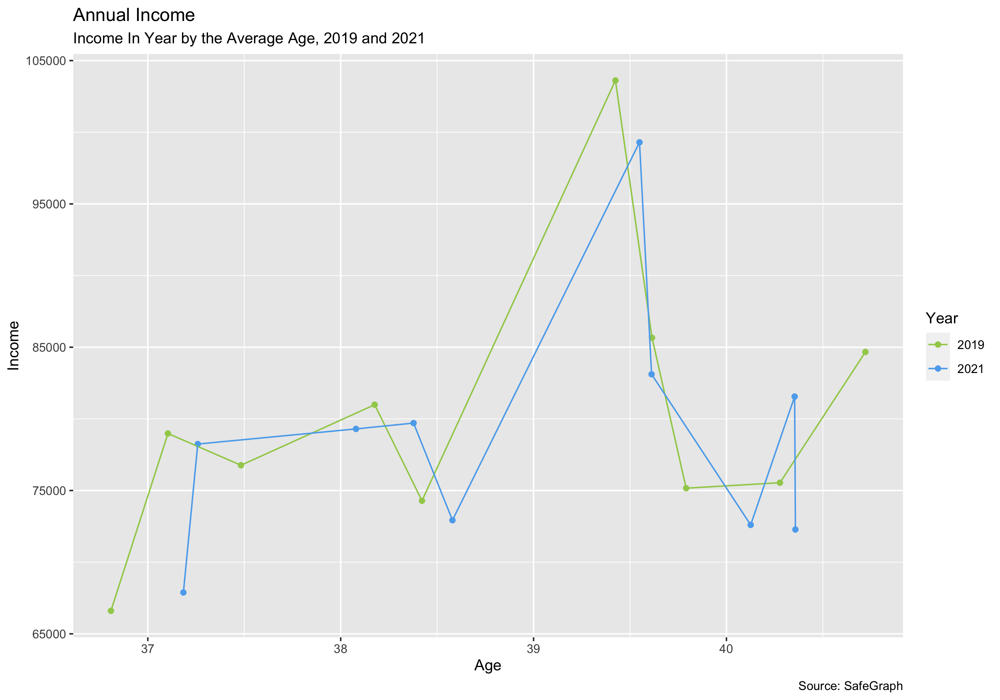
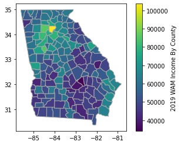
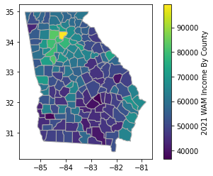
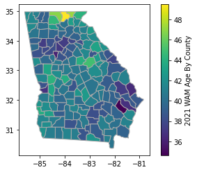
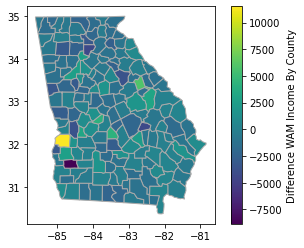
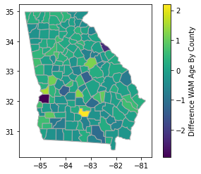

# Hackathon, Gas Stations

As a team we wanted to look at the profile of gas station customers in Georgia pre and post covid (assumption July 2019 & July 2021 are pre and post covid months). Looking at the following graph we can see that overall income is down year over year for most ages.  Looking at normal income changes this would be strange; however, we are looking only at the customers visiting gas stations. The hypothesis is that remote work popularity would impact what type of customers are buying gas now versus those purchasing gas before covid struck the state of Georgia.

## Gas Station Customers 2019, 2021, and Evolving Customer Profiles

The first two graphs are the weighted average income for 2019 and 2021 by county for Georgia gas station customers. The static heatmap is difficult to see if there are changes over the two years. 

   

Below one can see the top 10 counties by income levels to see clearly how income has shifted over the two years.  Eight of these counties have seen decreases.  We hypothesize this is a result of more highly paid professionals working from home reducing their need for gas fill ups.

Viewing an interactive map will help look at some of the details.

[2019 Interactive Map](documents/ga_p3_income19.html)
[2021 Interactive Map](documents/ga_p3_income21.html)

The next two graphs are the weighted average age for 2019 and 2021 by county for Georgia gas station customers. Like the income graph this graph is difficult to see if there are changes over the two years. 

   

Viewing the age change details for the top 10 counties by income shows what one would expect.  Most counties have slight increases in weighted average ages; however, Fayette does see a significant drop in average ages.  Additional research will be needed to determine if this is driven by deaths of older persons, higher birth rates, transplants, etc...

Viewing the previous interactive map will help look at some of the details on ages as well.

The final two heat maps show the diffence in weighted average income and age between 2019 and 2021 gas station customers.  Around metro Atlanta we see drops in most suburban counties.  The one oddity is one county, Stewart, in western Georgia that saw an increase in weighted average of income in excess of $11k.  

   

[2021 - 2019 Difference Interactive Map](documents/ga_p3_diff_income.html)

## Final Thoughts

As expected weighted average incomes came down Pre and Post covid.  Additional research needs to be done to determine which variables had the most impact on this:  work from home changes, job losses, traffic patterns, incoming transplants, outgoing professionals, business closures.

# Formula 1 Data Analysis

I wanted to find if there was a significance in predicting a drivers final placement in a race given the drivers starting position and what team they drive for. In conclusion, there is a major significance in a what team they drive for and what position they start in.

Click the link below to view project:

# GDP Capita per Continent ()

Tidyverse and ggplot were used to create a visialization of the relationship between GDP Capita and Life Expectancy per Continent since 1952.